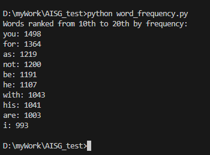

# Overview
This repository contains 2 sub projects:
- `word_frequency.py`: A Python script. This is the solution to part 1 of the assignment.
- `my-app`: A folder containing a next.js application. This is the solution to part 2 of the assignment.

# How to run the projects
1. Clone the repository or download the source code
```bash
git clone git@github.com:joeyHXD/tech-assignment.git
```
2. Navigate to the project directory
```bash
cd tech-assignment
```

## Part 1: word_frequency.py
- Assuming that python is installed, the script can be run from the command line as follows:
    ```bash
    python word_frequency.py
    ```
- There are no package dependencies for this script. It uses only the standard library.
- The output will look as follows:
- [](assets/image.png)
- Note: While words ranked from 10th to 20th by frequency would typically mean 11 words, this program returns only the 10th through 19th most frequent words, which only contained 10 words, to align with the sample output provided in the assignment. This can be adjusted in the main function of the script.

## Part 2: my-app
1. Install the dependencies:
```bash
cd my-app
npm install
```
2. Start the development server:
```bash
npm run dev
```
3. Open [http://localhost:3000](http://localhost:3000) in your browser
4. The web app will look as below:

https://github.com/user-attachments/assets/a54a2702-373c-41c7-ad8a-5ab930f8e5e3

